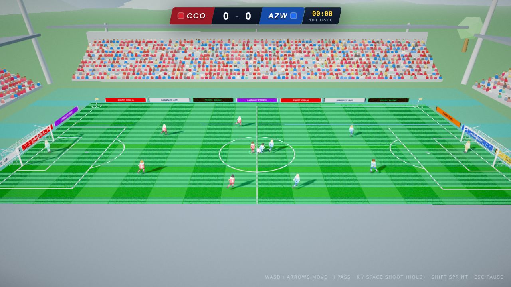

# GOALSTORM — Arcade Football

A fast, pick-up-and-play **browser football game** built to feel and look like a
shipped Unity title — but it's pure WebGL (Three.js) with **zero external art or
audio assets**. Everything (pitch, players, ball, crowd, sky, sound) is generated
procedurally at runtime. It's an original game inspired by the 90s arcade-football
feel of titles like *Golazo!* — same spirit of no-fouls, no-offsides, end-to-end
action, but its own art, code, teams and physics.



## Play

Open `index.html` through any static web server (it needs `vendor/three.min.js`
to load, so `file://` won't work in some browsers). For example:

```bash
npx http-server -p 8099 -c-1
# then open http://127.0.0.1:8099/
```

No build step, no dependencies to install — just static files.

## Controls

**1 Player / Watch**

| Action | Keys |
| --- | --- |
| Move | `WASD` or Arrow keys |
| Pass | `J` (or `Z`) |
| Shoot (hold to charge) | `K` / `Space` (or `X`) |
| Sprint | `Shift` / `L` |
| Pause | `Esc` |

**2 Player (split keyboard)**

| | Move | Pass | Shoot | Sprint |
| --- | --- | --- | --- | --- |
| P1 | `WASD` | `C` | `V` | `B` |
| P2 | Arrows | `K` | `L` | `Right Shift` |

Gamepads are auto-detected (left stick / d-pad to move, face buttons to
pass/shoot, shoulders to sprint).

**Tips**
- You always control the player nearest the ball; control switches automatically.
- Without the ball, tap pass/shoot to slide-tackle toward the ball.
- Charge the shoot button for power, and flick the stick sideways as you release
  to bend the shot (Magnus curve).
- Grab the glowing orbs that appear on the pitch for a temporary team boost:
  **Super Sprint**, **Super Shot** (flaming, extra-powerful) or **Super Tackle**.

## What's in the box

- **Graphics** — custom deferred-style post pipeline: HDR scene buffer, threshold
  + separable gaussian **bloom**, **FXAA**, filmic tone-map, saturation/split-tone
  color grade, vignette and subtle film grain. Toon-shaded characters, soft
  shadows, procedural sky with sun/haze/drifting clouds, a blimp, floodlights,
  rotating ad-boards, mountains and a city skyline.
- **Stadium** — striped, mown-and-worn pitch texture with full line markings;
  goals with a real **spring-simulated net** that ripples when the ball hits it;
  tiered stands packed with a **GPU crowd** of thousands that bounces and surges
  with the crowd-excitement system.
- **Players** — fully jointed procedural footballers with run / idle / kick /
  slide / stun and three celebration animations, per-team kits, jersey numbers,
  keeper gloves and a selection ring.
- **Ball physics** — gravity, restitution bounce, rolling friction, air drag,
  **Magnus curve from spin**, post/crossbar/wall collisions, rolling rotation and
  a height-reactive shadow.
- **AI** — role-aware (GK / DEF / MID / ATT) decision-making over a formation that
  slides with the ball: chase, mark, support runs, dribble, pass selection,
  shooting and a shot-stopping/rushing keeper. Three difficulty tiers.
- **Match** — kickoff, two halves with end-swap at half time, scoring with goal
  banners and confetti/fireworks, possession & shot stats, full-time summary,
  pause menu with quality and sound options.
- **Audio** — a procedural WebAudio engine: living crowd bed, ball kicks, leather
  taps, post clanks, whistles, goal roars, air-horns and UI blips.

## Project layout

```
index.html        markup, CSS UI (menus, HUD, scoreboard), script load order
vendor/three.min.js   Three.js r128 (MIT)
js/utils.js       constants, math, texture helpers, team data
js/audio.js       procedural WebAudio sound engine
js/input.js       keyboard (1P/2P) + gamepad with charged-input edges
js/gfx.js         renderer, post-processing chain, particle pools, sky
js/stadium.js     pitch, goals + spring nets, stands, crowd, props, lights
js/player.js      procedural character model + animation + movement
js/ball.js        ball physics, collisions, goal detection, visuals
js/ai.js          role-based team AI and difficulty
js/match.js       possession, shooting/passing/tackling, boosts, camera, scoring
js/main.js        boot, menu flow, HUD hooks, main loop
test/             Playwright smoke/screenshot scripts (dev only)
```

## Testing

A headless Playwright smoke test boots the game, plays a match and asserts there
are no runtime errors, capturing screenshots:

```bash
node test/smoke.js
```
